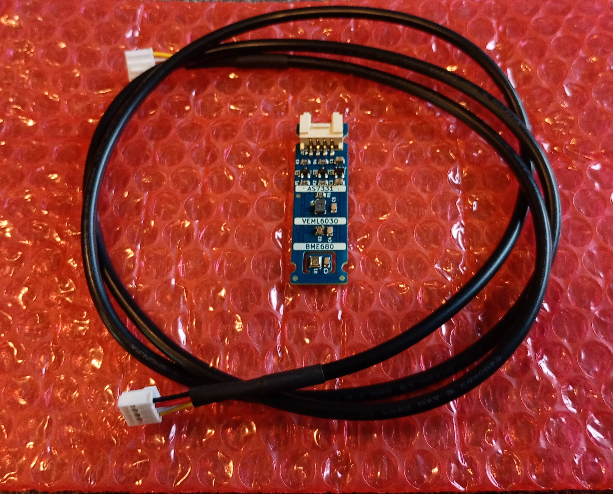

The **Freya Sensor** ...

 

## License & Collaboration
**Copyright© 2024 Sanne 'SpuQ' Santens**. This project is released under the [**CERN OHL-W**](LICENSE.txt) license. However, [trademark rules](https://github.com/Freya-Vivariums/.github/blob/main/brand/Freya_Trademark_Rules_and_Guidelines.md) apply to the Freya™ brand.

### Collaboration

If you'd like to contribute to this project, please follow these guidelines:
1. Fork the repository and create your branch from `main`.
2. Make your changes and ensure they adhere to the project's design style and conventions.
3. Test your changes thoroughly.
4. Ensure your commits are descriptive and well-documented.
5. Open a pull request, describing the changes you've made and the problem or feature they address.